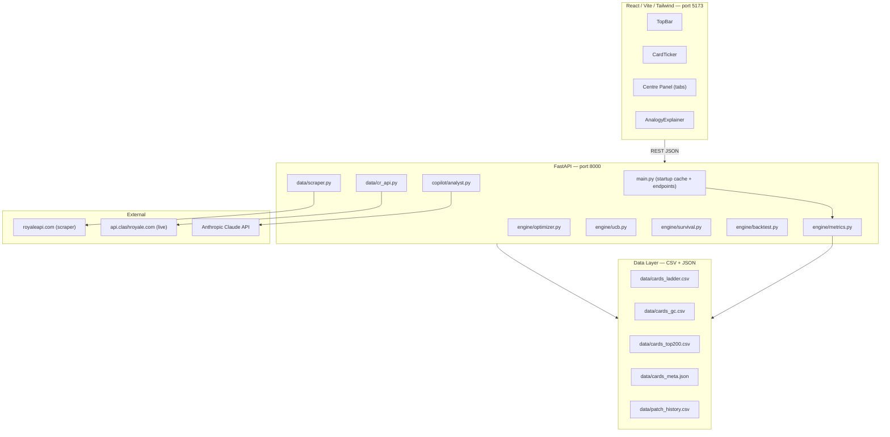

# Design Document — Clash Markets

## Overview

Clash Markets is a Bloomberg Terminal-style analytics platform for Clash Royale. It applies quantitative finance methodology to real card game data: Markowitz mean-variance optimisation for deck construction, UCB multi-armed bandits for personalised recommendations, Kaplan-Meier survival analysis for alpha decay, and six invented statistics (MPS, ESR, MM, Deck Beta, ADR, Clash Alpha) that map finance concepts onto card game mechanics.

The system is a two-tier web application:
- **Backend**: FastAPI (Python 3.11+) serving a REST API, with all computation done in-memory using pandas DataFrames. No database — data lives in CSV files and JSON loaded at startup.
- **Frontend**: React + Vite + Tailwind CSS with a Bloomberg Terminal dark-navy aesthetic, using Recharts for all data visualisations.

The primary demo scenario: a judge enters their Clash Royale player tag, receives a personalised UCB deck recommendation, sees their deck plotted on the efficient frontier, and asks the Claude AI analyst why the meta is the way it is.

---

## Architecture



### Startup Sequence

1. `uvicorn main:app` starts the FastAPI process.
2. The `startup` event handler calls `compute_all_metrics()`.
3. `compute_all_metrics()` reads the three market CSVs, merges `cards_meta.json`, and computes all six statistics, returning a single merged DataFrame.
4. The DataFrame is stored in `app.state.cards_data` — all subsequent requests read from this cache.
5. No recomputation happens per-request (except frontier sampling, which is fast enough at 2000 iterations).

### Data Flow

```
CSV files + cards_meta.json
        ↓ compute_all_metrics()
   Merged DataFrame (in-memory)
        ↓ app.state.cards_data
   FastAPI endpoints
        ↓ JSON (orient="records", 4dp)
   React components
        ↓ Recharts / tables
   User
```

---

## Components and Interfaces

### Backend Modules

#### `data/scraper.py`

```python
def scrape_market(cat: str) -> pd.DataFrame:
    # cat: "Ladder" | "GC" | "TopRanked200" | "TopRanked" | "Ranked"
    # Returns: DataFrame[card_name, win_rate, usage_rate]
    # Raises: Exception on non-200 or timeout
```

#### `data/cr_api.py`

```python
def fetch_cards_metadata() -> list[dict]:
    # Returns: [{id, name, elixir, rarity, type}, ...]

def fetch_player_battlelog(player_tag: str) -> list[dict]:
    # Returns: up to 25 battle objects, or [] on 404
```

#### `engine/metrics.py`

```python
def compute_all_metrics() -> pd.DataFrame:
    # Returns merged DataFrame with columns:
    # card_name, win_rate, usage_rate, market, elixir, rarity, type,
    # mps, mps_z, win_rate_vol, esr, meta_momentum, deck_beta, clash_alpha

def build_card_history(card_name: str, df: pd.DataFrame) -> dict:
    # Returns: {card_name, time_series: [{date, win_rate}], patch_events: [...]}

def compute_deck_ca(cards: list[dict], df: pd.DataFrame,
                    patch_history: pd.DataFrame | None = None) -> float:
    # cards: list of 8 card dicts with mps_z, deck_beta
    # Raises ValueError if len(cards) != 8
```

#### `engine/optimizer.py`

```python
def compute_frontier(df: pd.DataFrame, elixir_budget: float = 3.5) -> dict:
    # Returns: {frontier_points: [{return, risk, sharpe, clash_alpha, deck, avg_elixir}],
    #           max_sharpe_deck: {...}, n_decks_sampled: int}

def compute_optimal_deck(df: pd.DataFrame, elixir_budget: float = 3.5) -> dict:
    # Returns: the max_sharpe_deck point
```

#### `engine/ucb.py`

```python
def compute_ucb_recommendations(battle_log: list, df: pd.DataFrame,
                                  c: float = 1.4) -> dict:
    # Returns: {recommended_deck: [card_name, ...],
    #           scored_cards: [{card_name, ucb_score, personal_win_rate,
    #                           global_win_rate, personal_games, alpha, action}],
    #           total_battles: int}
```

#### `engine/survival.py`

```python
def compute_survival_curves() -> dict:
    # Returns: {km_curves: [{rarity, curve: [{time, survival_probability}]}],
    #           cox_results: {coefficients: {...}, p_values: {...}},
    #           warning: str | None}
```

#### `engine/backtest.py`

```python
def run_all_strategies(df: pd.DataFrame) -> dict:
    # Returns: {strategies: {patch_momentum: {...}, ucb_optimal: {...},
    #                         contrarian: {...}},
    #           benchmark: [{date, cumulative_win_rate}],
    #           warning: str | None}
    # Each strategy: {equity_curve, sharpe, max_drawdown,
    #                 total_excess_win_rate, ca_trajectory}
```

#### `copilot/analyst.py`

```python
async def generate_analyst_report(query: str, context: dict,
                                    df: pd.DataFrame) -> dict:
    # Returns: {report: str}
    # Falls back to error message if API key missing
```

### API Endpoints

| Method | Path | Query Params | Body | Response |
|--------|------|-------------|------|----------|
| GET | `/api/cards` | `market=ladder\|gc\|top200\|all` | — | `[CardRecord]` |
| GET | `/api/cards/{card_name}/history` | — | — | `CardHistory` |
| GET | `/api/frontier` | `budget=3.5` | — | `FrontierResult` |
| GET | `/api/optimize` | `budget=3.5` | — | `DeckPoint` |
| GET | `/api/ucb` | `player_tag` | — | `UCBResult` |
| GET | `/api/survival` | — | — | `SurvivalResult` |
| GET | `/api/backtest` | — | — | `BacktestResult` |
| GET | `/api/cross-market` | — | — | `CrossMarketResult` |
| POST | `/api/analyst` | — | `{query, context?}` | `{report}` |

All error responses: `{"detail": "..."}` with HTTP 500.

### Frontend Components

| Component | Tab/Panel | Data Source |
|-----------|-----------|-------------|
| `TopBar` | Top bar | `/api/cards` (ticker scroll) |
| `CardTicker` | Left panel | `/api/cards` |
| `PatchTimeline` | Centre — default | `/api/cards/{name}/history` |
| `PortfolioMaker` | Centre — Portfolio tab | `/api/frontier` + local state |
| `EfficientFrontier` | Centre — Frontier tab | `/api/frontier` |
| `AlphaDecay` | Centre — Survival tab | `/api/survival` |
| `CrossMarket` | Centre — Cross-Market tab | `/api/cross-market` |
| `BacktestReport` | Centre — Backtest tab | `/api/backtest` |
| `AnalystChat` | Centre — Analyst tab | `POST /api/analyst` |
| `AnalogyExplainer` | Right panel | Static + event-driven |

---

## Data Models

### DataFrame Schema (in-memory, post `compute_all_metrics`)

| Column | Type | Description |
|--------|------|-------------|
| `card_name` | str | Canonical card name |
| `win_rate` | float64 | Decimal fraction [0,1] |
| `usage_rate` | float64 | Decimal fraction [0,1] |
| `market` | str | `"ladder"` \| `"gc"` \| `"top200"` |
| `elixir` | float64 | Elixir cost (default 4.0 if missing) |
| `rarity` | str | `"common"` \| `"rare"` \| `"epic"` \| `"legendary"` |
| `type` | str | `"troop"` \| `"spell"` \| `"building"` |
| `mps` | float64 | Raw regression residual |
| `mps_z` | float64 | Z-normalised MPS within market |
| `win_rate_vol` | float64 | Std of win_rate across markets (min 0.01) |
| `esr` | float64 | Elixir Sharpe Ratio |
| `meta_momentum` | float64 | (usage_gc - usage_ladder) / (usage_ladder + 0.001) |
| `deck_beta` | float64 | Rarity-based beta heuristic |
| `clash_alpha` | float64 | Per-card alpha signal (mps_z - deck_beta × 0.5) |

### CSV Schemas

**`cards_ladder.csv` / `cards_gc.csv` / `cards_top200.csv`**
```
card_name,win_rate,usage_rate
```

**`patch_history.csv`**
```
date,card_name,change_type,stat_changed,magnitude
2024-01-15,Hog Rider,buff,damage,+0.10
```

### JSON API Response Types

**CardRecord**
```json
{
  "card_name": "Hog Rider",
  "win_rate": 0.5432,
  "usage_rate": 0.1234,
  "market": "ladder",
  "elixir": 4.0,
  "rarity": "rare",
  "mps_z": 1.8234,
  "esr": 0.2341,
  "meta_momentum": 0.1234,
  "deck_beta": 0.85,
  "clash_alpha": 1.3984
}
```

**DeckPoint**
```json
{
  "return": 0.5312,
  "risk": 0.0234,
  "sharpe": 1.3291,
  "clash_alpha": 0.8234,
  "deck": ["Hog Rider", "Musketeer", "..."],
  "avg_elixir": 3.4
}
```

**UCBCardScore**
```json
{
  "card_name": "Hog Rider",
  "ucb_score": 0.7823,
  "personal_win_rate": 0.6300,
  "global_win_rate": 0.5200,
  "personal_games": 42,
  "alpha": 1.0,
  "action": "EXPLOIT"
}
```

---

## Correctness Properties

*A property is a characteristic or behavior that should hold true across all valid executions of a system — essentially, a formal statement about what the system should do. Properties serve as the bridge between human-readable specifications and machine-verifiable correctness guarantees.*


### Property 1: MPS z-score mean invariant

*For any* market with 3 or more cards, after computing `mps_z`, the mean of all `mps_z` values within that market SHALL equal 0.0 within floating-point tolerance of 1e-9.

**Validates: Requirements 5.3, 5.5**

---

### Property 2: win_rate and usage_rate are valid fractions

*For any* card returned by the scraper or loaded from CSV, `win_rate` and `usage_rate` SHALL be decimal fractions in the range [0.0, 1.0].

**Validates: Requirements 1.2**

---

### Property 3: ESR formula correctness

*For any* card with `elixir > 0` and `win_rate_vol >= 0.01`, `esr` SHALL equal `((win_rate - 0.50) / win_rate_vol) * (1 / elixir)` within floating-point tolerance.

**Validates: Requirements 6.3**

---

### Property 4: win_rate_vol minimum clamp

*For any* card in the merged DataFrame, `win_rate_vol` SHALL be greater than or equal to 0.01 after clipping.

**Validates: Requirements 6.2**

---

### Property 5: Meta Momentum formula and missing-data default

*For any* card present in both ladder and GC data, `meta_momentum` SHALL equal `(usage_gc - usage_ladder) / (usage_ladder + 0.001)`. *For any* card absent from GC data, `meta_momentum` SHALL equal 0.0.

**Validates: Requirements 7.1, 7.2**

---

### Property 6: Deck Beta mapping completeness

*For any* card, `deck_beta` SHALL equal the value from the rarity mapping (`legendary→1.2`, `epic→1.0`, `rare→0.85`, `common→0.75`) or 0.9 if the rarity is absent or unrecognised.

**Validates: Requirements 8.1, 8.2**

---

### Property 7: Kaplan-Meier survival function is monotonically non-increasing

*For any* survival curve returned by `compute_survival_curves()`, the `survival_probability` values SHALL be non-increasing as `time` increases.

**Validates: Requirements 9.3**

---

### Property 8: Clash Alpha requires exactly 8 cards

*For any* call to the CA computation function with a deck containing fewer or more than 8 cards, the function SHALL raise a `ValueError` with the message `"Deck must contain exactly 8 cards"`.

**Validates: Requirements 10.5**

---

### Property 9: Efficient Frontier deck validity invariant

*For any* deck point in the frontier result, the deck SHALL contain exactly 8 card names and `avg_elixir` SHALL be less than or equal to `elixir_budget` (unless the budget was relaxed due to insufficient eligible cards).

**Validates: Requirements 11.1, 11.2**

---

### Property 10: Max-Sharpe deck is the global maximum

*For any* frontier result, `max_sharpe_deck.sharpe` SHALL be greater than or equal to the `sharpe` of every other point in `frontier_points`.

**Validates: Requirements 11.4**

---

### Property 11: UCB alpha confidence weight is clamped to [0, 1]

*For any* card with `n_i >= 0`, `alpha = min(1.0, n_i / 30)` SHALL be in the range [0.0, 1.0].

**Validates: Requirements 12.3**

---

### Property 12: UCB action label assignment

*For any* card scored by the UCB engine, the action label SHALL be `"EXPLOIT"` iff `n_i >= 30` and `personal_win_rate > global_win_rate`; `"EXPLORE"` iff `n_i < 10`; `"AVOID"` iff `personal_win_rate < global_win_rate - 0.05`; otherwise `"HOLD"`.

**Validates: Requirements 12.6**

---

### Property 13: Serialisation round-trip preserves numeric precision

*For any* card metric object serialised to JSON and parsed back, the numeric fields `win_rate`, `usage_rate`, `mps_z`, `esr`, `meta_momentum`, and `deck_beta` SHALL retain their values within a tolerance of 0.0001.

**Validates: Requirements 27.2**

---

### Property 14: Backtest equity curve structural validity

*For any* strategy result from `run_all_strategies()`, the `equity_curve` SHALL be a non-empty list of objects each containing a `date` (ISO 8601 string) and a `cumulative_win_rate` (float).

**Validates: Requirements 13.5**

---

## Error Handling

### Backend

| Scenario | Behaviour |
|----------|-----------|
| Scraper HTTP non-200 or timeout | Raise descriptive exception with market name |
| `CR_API_TOKEN` not set | `RuntimeError("CR_API_TOKEN not set in environment")` at client init |
| Player tag 404 | Return `[]`, log warning |
| `ANTHROPIC_API_KEY` missing or API failure | Return `{"report": "Analyst unavailable. Check ANTHROPIC_API_KEY configuration."}` |
| Deck != 8 cards passed to CA | `ValueError("Deck must contain exactly 8 cards")` |
| Fewer than 3 cards in market for MPS | Set `mps_z = 0.0`, log warning |
| Fewer than 5 buff events for survival | Return `{"warning": "Insufficient buff events for survival analysis"}` |
| Fewer than 5 patch events for backtest | Return `{"warning": "Insufficient patch history for reliable backtesting"}` |
| Card missing from `cards_meta.json` | Assign `elixir = 4.0`, log warning |
| Any unhandled endpoint exception | HTTP 500 `{"detail": "<error message>"}` |
| Elixir budget too restrictive (< 8 eligible cards) | Relax constraint, log warning |

### Frontend

| Scenario | Behaviour |
|----------|-----------|
| API call pending > 300ms | Show loading spinner |
| API returns error or warning | Display warning/error message in component |
| No card selected in CardTicker | PatchTimeline shows `"Select a card to view its history"` |
| Analyst API unavailable | Display fallback message in distinct error style |
| User tries to add 9th card to deck | Show error message, prevent addition |
| Survival API returns warning | Display warning text instead of chart |
| Backtest API returns warning | Display warning prominently above chart |

---

## Testing Strategy

### Dual Testing Approach

Both unit tests and property-based tests are required. They are complementary:
- **Unit tests** catch concrete bugs with specific examples, integration points, and edge cases.
- **Property tests** verify universal correctness across all inputs, catching bugs that specific examples miss.

### Property-Based Testing Library

**Python backend**: [`hypothesis`](https://hypothesis.readthedocs.io/) — the standard PBT library for Python.

Each property test MUST run a minimum of 100 iterations (Hypothesis default is 100; use `@settings(max_examples=100)` explicitly).

Each property test MUST include a comment tag in the format:
```
# Feature: clash-markets, Property N: <property_text>
```

Each correctness property from the design document MUST be implemented by exactly one property-based test.

### Unit Test Coverage

Unit tests (using `pytest`) should cover:
- Specific examples for each engine function (known input → known output)
- Integration between `compute_all_metrics()` and each downstream engine
- All error conditions (missing env vars, bad inputs, insufficient data)
- API endpoint response shapes and HTTP status codes (using `httpx` + FastAPI `TestClient`)
- Frontend component rendering with mock API data (using Vitest + React Testing Library)

Unit tests should NOT duplicate what property tests already cover. Focus on:
- Edge cases explicitly called out in requirements (< 3 cards, < 5 buff events, etc.)
- Integration smoke tests (startup cache is populated, endpoints return 200)
- Error path verification

### Property Test Specifications

```python
# Property 1: MPS z-score mean invariant
# Feature: clash-markets, Property 1: MPS z-score mean equals 0 within each market
@given(market_df=st.dataframes_with_3plus_cards())
@settings(max_examples=100)
def test_mps_z_mean_is_zero(market_df):
    result = compute_mps_for_market(market_df)
    assert abs(result["mps_z"].mean()) < 1e-9

# Property 2: win_rate and usage_rate in [0,1]
# Feature: clash-markets, Property 2: scraped values are valid fractions
@given(mock_html=st.valid_royaleapi_html())
@settings(max_examples=100)
def test_scraped_values_in_range(mock_html):
    df = parse_market_html(mock_html)
    assert (df["win_rate"].between(0, 1)).all()
    assert (df["usage_rate"].between(0, 1)).all()

# Property 3: ESR formula correctness
# Feature: clash-markets, Property 3: ESR equals formula value
@given(card=st.card_with_positive_elixir())
@settings(max_examples=100)
def test_esr_formula(card):
    expected = ((card["win_rate"] - 0.50) / card["win_rate_vol"]) * (1 / card["elixir"])
    assert abs(card["esr"] - expected) < 1e-9

# Property 4: win_rate_vol minimum clamp
# Feature: clash-markets, Property 4: win_rate_vol >= 0.01
@given(df=st.card_dataframes())
@settings(max_examples=100)
def test_win_rate_vol_clamp(df):
    result = compute_all_metrics_from(df)
    assert (result["win_rate_vol"] >= 0.01).all()

# Property 5: Meta Momentum formula
# Feature: clash-markets, Property 5: meta_momentum formula and missing-data default
@given(ladder=st.market_df(), gc=st.market_df())
@settings(max_examples=100)
def test_meta_momentum(ladder, gc):
    result = compute_meta_momentum(ladder, gc)
    for _, row in result.iterrows():
        if row["card_name"] in gc["card_name"].values:
            expected = (row["usage_gc"] - row["usage_ladder"]) / (row["usage_ladder"] + 0.001)
            assert abs(row["meta_momentum"] - expected) < 1e-9
        else:
            assert row["meta_momentum"] == 0.0

# Property 6: Deck Beta mapping
# Feature: clash-markets, Property 6: deck_beta from rarity mapping or default
@given(rarity=st.text())
@settings(max_examples=100)
def test_deck_beta_mapping(rarity):
    beta = assign_deck_beta(rarity)
    mapping = {"legendary": 1.2, "epic": 1.0, "rare": 0.85, "common": 0.75}
    expected = mapping.get(rarity.lower(), 0.9)
    assert beta == expected

# Property 7: KM survival monotonically non-increasing
# Feature: clash-markets, Property 7: survival probability is non-increasing
@given(survival_data=st.valid_survival_data())
@settings(max_examples=100)
def test_km_survival_monotone(survival_data):
    result = fit_kaplan_meier(survival_data)
    probs = [p["survival_probability"] for p in result["curve"]]
    assert all(probs[i] >= probs[i+1] for i in range(len(probs)-1))

# Property 8: CA ValueError for wrong deck size
# Feature: clash-markets, Property 8: CA raises ValueError for non-8-card decks
@given(n=st.integers().filter(lambda x: x != 8))
@settings(max_examples=100)
def test_ca_requires_8_cards(n, sample_cards):
    with pytest.raises(ValueError, match="Deck must contain exactly 8 cards"):
        compute_deck_ca(sample_cards[:n] if n < len(sample_cards) else sample_cards * 2)

# Property 9: Frontier deck validity
# Feature: clash-markets, Property 9: frontier decks have 8 cards and valid elixir
@given(budget=st.floats(min_value=3.0, max_value=4.5))
@settings(max_examples=100)
def test_frontier_deck_validity(budget, sample_df):
    result = compute_frontier(sample_df, elixir_budget=budget)
    for point in result["frontier_points"]:
        assert len(point["deck"]) == 8
        assert point["avg_elixir"] <= budget + 0.01  # small tolerance for relaxed budget

# Property 10: Max-Sharpe is global maximum
# Feature: clash-markets, Property 10: max_sharpe_deck has highest sharpe
@given(budget=st.floats(min_value=3.0, max_value=4.5))
@settings(max_examples=100)
def test_max_sharpe_is_maximum(budget, sample_df):
    result = compute_frontier(sample_df, elixir_budget=budget)
    best_sharpe = result["max_sharpe_deck"]["sharpe"]
    assert all(p["sharpe"] <= best_sharpe for p in result["frontier_points"])

# Property 11: UCB alpha clamped to [0,1]
# Feature: clash-markets, Property 11: UCB alpha in [0,1]
@given(n_i=st.integers(min_value=0, max_value=1000))
@settings(max_examples=100)
def test_ucb_alpha_clamped(n_i):
    alpha = min(1.0, n_i / 30)
    assert 0.0 <= alpha <= 1.0

# Property 12: UCB action label rules
# Feature: clash-markets, Property 12: UCB action label follows assignment rules
@given(card=st.ucb_card_data())
@settings(max_examples=100)
def test_ucb_action_labels(card):
    action = assign_action_label(card["n_i"], card["personal_wr"], card["global_wr"])
    if card["n_i"] >= 30 and card["personal_wr"] > card["global_wr"]:
        assert action == "EXPLOIT"
    elif card["n_i"] < 10:
        assert action == "EXPLORE"
    elif card["personal_wr"] < card["global_wr"] - 0.05:
        assert action == "AVOID"
    else:
        assert action == "HOLD"

# Property 13: Serialisation round-trip
# Feature: clash-markets, Property 13: JSON round-trip preserves numeric precision
@given(record=st.card_metric_records())
@settings(max_examples=100)
def test_serialisation_round_trip(record):
    import json
    serialised = json.dumps(record)
    parsed = json.loads(serialised)
    for field in ["win_rate", "usage_rate", "mps_z", "esr", "meta_momentum", "deck_beta"]:
        assert abs(record[field] - parsed[field]) < 0.0001

# Property 14: Backtest equity curve structure
# Feature: clash-markets, Property 14: equity curve is non-empty with valid structure
@given(df=st.card_dataframes_with_patch_history())
@settings(max_examples=100)
def test_backtest_equity_curve_structure(df):
    result = run_all_strategies(df)
    for strategy in ["patch_momentum", "ucb_optimal", "contrarian"]:
        curve = result["strategies"][strategy]["equity_curve"]
        assert len(curve) > 0
        for point in curve:
            assert "date" in point and "cumulative_win_rate" in point
```

### Frontend Testing

- **Vitest + React Testing Library** for component unit tests
- Test each component renders without crashing with mock API data
- Test CardTicker sort behaviour, market selector, and row click
- Test PortfolioMaker prevents 9th card addition
- Test AnalystChat displays loading state and renders response
- Test AnalogyExplainer highlights correct entry on metric hover
